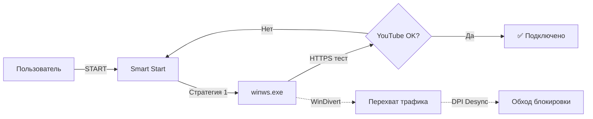

<div align="center">

# 🛡️ ZOVpret

### Расширенная GUI-оболочка для обхода DPI-цензуры

[](https://www.electronjs.org/)
[](https://react.dev/)
[](https://www.typescriptlang.org/)
[](LICENSE)
[](https://www.microsoft.com/windows)

**ZOVpret** — современное десктопное приложение с премиальным интерфейсом, предоставляющее «одно-кнопочное» решение для обхода Deep Packet Inspection (DPI). Построено на базе [zapret](https://github.com/bol-van/zapret) с использованием стратегий из [Flowseal/zapret-discord-youtube](https://github.com/Flowseal/zapret-discord-youtube).

---

</div>

## ✨ Возможности

### 🎯 Smart Start — Автоматический подбор стратегии
- Последовательное тестирование 7 стратегий обхода DPI
- HTTPS-проверка доступности YouTube, X (Twitter), Instagram
- Автоматическое сохранение рабочей стратегии
- Прогрессбар и статус каждой попытки в реальном времени

### 🔧 7 стратегий обхода из Flowseal
| Стратегия | Техника | Описание |
|-----------|---------|----------|
| **General** | multisplit + seqovl | Базовая, работает у большинства |
| **ALT** | fake + fakedsplit + TS | Альтернативная, TS fooling |
| **FAKE TLS AUTO** | multidisorder + rnd/dupsid | Максимальная обфускация |
| **SIMPLE FAKE** | fake + badseq | Минимальное воздействие |
| **ALT 2** | multidisorder + md5sig | Альтернативная #2 |
| **ALT 3** | multisplit + hopbyhop | Альтернативная #3 |
| **FAKE TLS AUTO ALT** | rnd + rndsni + badseq + ts | Модифицированная FAKE TLS |

### 🎨 Премиальный UI
- Компактное окно 420×680px (стиль VPN-приложения)
- Тёмная тема с glassmorphism и неоновым свечением
- Анимированная кнопка с SVG-кольцом прогресса
- Slide-in панель настроек с вкладками
- Кастомный безрамочный тайтлбар

### 📦 Автоматическое обновление
- Проверка последнего релиза Flowseal на GitHub
- Скачивание и распаковка бинарников (winws.exe, WinDivert)
- Обновление списков доменов

---

## 🖥️ Скриншот

<div align="center">

> *Компактный интерфейс в стиле VPN-приложения с центральной кнопкой включения.*

</div>

---

## 🚀 Быстрый старт

### Требования
- **Node.js** 18+ — [скачать](https://nodejs.org/)
- **Windows** 10/11 (x64)
- **Права администратора** (для работы WinDivert)

### Установка и запуск

```bash
# Клонируем репозиторий
git clone https://github.com/YOUR_USERNAME/ZOVpret.git
cd ZOVpret

# Устанавливаем зависимости
npm install

# Запускаем в dev-режиме
npm run dev
```

Или просто **двойной клик по `SETUP.bat`** в папке проекта.

### Первый запуск
1. Нажмите кнопку **↻ Обновить** для скачивания бинарников zapret
2. Нажмите **START** — Smart Start автоматически подберёт стратегию
3. Статус → **«Подключено»** — DPI-обход активен!

### Сборка для production

```bash
npm run build
```

Готовый установщик появится в папке `dist/`.

---

## 🏗️ Архитектура

```
ZOVpret/
├── src/
│   ├── main/                       # Electron Main Process
│   │   ├── index.ts                # Точка входа, создание окна
│   │   ├── ipc-handlers.ts         # IPC-мост (14 обработчиков)
│   │   ├── zapret-engine.ts        # Управление winws.exe
│   │   ├── smart-start.ts          # Автоподбор стратегии
│   │   ├── strategy-pool.ts        # 7 стратегий из Flowseal
│   │   ├── updater.ts              # Автообновление с GitHub
│   │   └── config-store.ts         # Хранение настроек
│   │
│   ├── preload/
│   │   └── index.ts                # contextBridge API
│   │
│   └── renderer/                   # React UI
│       ├── App.tsx                 # Корневой компонент
│       ├── components/
│       │   ├── TitleBar.tsx        # Кастомный тайтлбар
│       │   ├── PowerButton.tsx     # Центральная кнопка
│       │   ├── StatusIndicator.tsx # Индикатор статуса
│       │   ├── MainScreen.tsx      # Главный экран
│       │   └── SettingsPanel.tsx   # Панель настроек
│       └── styles/
│           └── globals.css         # Тёмная тема
│
└── resources/
    ├── bin/                        # Бинарники (скачиваются авто)
    └── lists/                      # Списки доменов
```

### Как это работает



1. **Smart Start** запускает `winws.exe` с первой стратегией
2. Делает HTTPS-запрос к тестовым доменам (YouTube, X, Instagram)
3. Если ответ 200/301/302 — стратегия работает, сохраняем
4. Если таймаут — останавливаем, пробуем следующую стратегию
5. `winws.exe` через **WinDivert** перехватывает TCP/UDP трафик и применяет DPI-десинхронизацию

---

## 🔒 Безопасность

- **Не является VPN/прокси** — трафик не проходит через сторонние серверы
- **Работает локально** — весь обход происходит на вашем компьютере через WinDivert
- **Открытый исходный код** — весь код доступен для аудита
- **Бинарники из оригинального zapret** — можно проверить хэши на [bol-van/zapret-win-bundle](https://github.com/bol-van/zapret-win-bundle)

### Антивирусы
WinDivert может вызвать реакцию антивируса — это нормально. WinDivert — легитимный инструмент для перехвата/фильтрации трафика, его драйвер `WinDivert64.sys` имеет цифровую подпись. При необходимости добавьте папку `resources/bin` в исключения антивируса.

---

## ⚙️ Конфигурация

Настройки хранятся через `electron-store` и сохраняются между перезапусками:

| Параметр | Описание | По умолчанию |
|----------|----------|--------------|
| `lastStrategyId` | Последняя рабочая стратегия | `null` (авто) |
| `filterMode` | Режим фильтрации | `hostlist` |
| `autoUpdate` | Автопроверка обновлений | `true` |
| `customDomains` | Пользовательские домены | `[]` |

### Пользовательские домены
Добавьте свои домены в `resources/lists/list-general-user.txt` (по одному на строку):

```
example.com
myservice.net
```

### Исключения
Домены, которые НЕ должны проходить через обход, добавьте в `resources/lists/list-exclude-user.txt`.

---

## 🤝 Благодарности

- [bol-van/zapret](https://github.com/bol-van/zapret) — ядро DPI-десинхронизации
- [Flowseal/zapret-discord-youtube](https://github.com/Flowseal/zapret-discord-youtube) — стратегии и бинарники
- [basil00/WinDivert](https://github.com/basil00/WinDivert) — перехват трафика на Windows
- [electron-vite](https://electron-vite.org/) — сборщик для Electron + React

---

## 📄 Лицензия

MIT License — см. [LICENSE](LICENSE)

---

<div align="center">

**⚡ Свобода интернета в одном клике ⚡**

</div>
